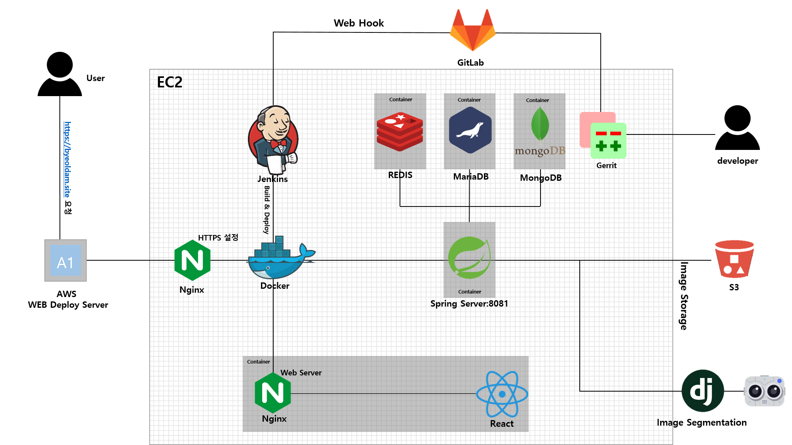

<details>
<summary><h1>서비스 소개</h1></summary>
<h2>별을 담다</h2>


<summary><h1>역할</h1></summary>
    <table>
        <thead>
        	<th>이름</th>
            <th>역할</th>
        </thead>
        <tbody>
        	<tr>
            	<td>김수혁</td>
                <td>Backend, AI, 팀장</td>
            </tr>
            <tr>
            	<td>이민우</td>
                <td>BE Leader, Git Master, PM</td>
            </tr>
            <tr>
            	<td>이은규</td>
                <td>Frontend, UI/UX Design Chief</td>
            </tr>
            <tr>
            	<td>이창헌</td>
                <td>Backend, Jira master</td>
            </tr>
            <tr>
            	<td>차현철</td>
                <td>Backend, Presenter, AI</td>
            </tr>
            <tr>
            	<td>황정민</td>
                <td>FE Leader</td>
            </tr>
        </tbody>
    </table>

</details>

<details>
<summary><h1>깃 컨벤션</h1></summary>
<div markdown="1">

---

# 1. Commit 컨벤션

---

[Git | git 커밋 컨벤션 설정하기](https://velog.io/@shin6403/Git-git-커밋-컨벤션-설정하기)

## 1) Commit

### (1) Commit 메시지 구조

기본적인 커멧 메시지 구조는 제목, 본문, 꼬리말 세가지 파트로 나눈다.

각 파트는 빈줄로 두어 구분한다.

```java
type : subject

body

footer
```

### (2) Commit Type

타입은 태그와 제목으로 구성한다.

태그는 영어로 쓰되 첫 문자는 대문자로 작성한다.

`#이슈번호 - 태그 : 제목`의 형태이며, `:` 뒤에만 space가 있음을 유의한다.

- `feat` : 새로운 기능 추가
- `fix` : 버그 수정
- `docs` : 문서 수정
- `style` : 코드 포맷팅, 세미콜론 누락, 코드 변경이 없는 경우
- `refactor` : 코드 리펙토링
- `test` : 테스트 코드, 리펙토링 테스트 코드 추가
- `chore` : 빌드 업무 수정, 패키지 매니저 수정

### (3) Commit Subject

제목은 최대 50글자가 넘지 않도록 하고 마침표 및 특수기호는 사용하지 않는다.

영문으로 표기하는 경우 동사를 가장 앞에 두고 첫 글자는 대문자로 표기한다.

제목은 **개조식 구문**으로 작성한다. (완전한 서술형 문장이 아니라, 간결하고 요점적인 서술을 의미)

**나쁜 예**

```java
Fixed
Added
Modified
```

**좋은 예**

```java
Fix
Add
Modify
```

### (4) Commit Body

본문은 한 줄 당 72자 내로 작성한다.

본문 내용은 양에 구애받지 않고 최대한 상세히 작성한다.

본문 내용은 어떻게 변경했는지보다 무엇을 변경했는지 또는 왜 변경했는지를 설명한다.

### (5) Commit Footer

꼬리말은 `optional`이고 `이슈 트래커 ID`를 작성한다.

꼬리말은 `“유형 : #이슈 번호”` 형식으로 사용한다.

여러 개의 이슈 번호를 적을 때는 `쉼표(,)`로 구분한다.

이슈 트래커 유형은 다음 중 하나를 사용한다.

- **Fixes** : 이슈 수정 중 (아직 해결되지 않은 경우)
- **Resolves** : 이슈를 해결했을 때 사용
- **Ref** : 참고할 이슈가 있을 때 사용
- **Related to** : 해당 커밋에 관련된 이슈번호 (아직 해결되지 않은 경우)

`ex) Fixes : #45 Related to : #34, #23`

### (6) Commit example

```
Feat: "회원 가입 기능 구현"

SMS, 이메일 중복확인 API 개발

Resolves: #123
Ref: #456
Related to: #48, #45
```

### (7) Commit Message Emogji

이모지는 다음과 같이 사용한다.

자세한 부분에 대해서는 '[Gitmoji 사용하기](https://treasurebear.tistory.com/70)' 여기 설명이 잘되어 있는 글이 있어, 이 링크를 참조 부탁한다.

| Emogi | Description                                                       |
| ----- | ----------------------------------------------------------------- |
| 🎨    | 코드의 형식 / 구조를 개선 할 때                                   |
| 📰    | 새 파일을 만들 때                                                 |
| 📝    | 사소한 코드 또는 언어를 변경할 때                                 |
| 🐎    | 성능을 향상시킬 때                                                |
| 📚    | 문서를 쓸 때                                                      |
| 🐛    | 버그 reporting할 때, @FIXME 주석 태그 삽입                        |
| 🚑    | 버그를 고칠 때                                                    |
| 🔥    | 코드 또는 파일 제거할 때 , @CHANGED주석 태그와 함께               |
| 🚜    | 파일 구조를 변경할 때 . 🎨과 함께 사용                            |
| 🔨    | 코드를 리팩토링 할 때                                             |
| 💄    | UI / style 개선시                                                 |
| ♿️   | 접근성을 향상시킬 때                                              |
| 🚧    | WIP (진행중인 작업)에 커밋, @REVIEW주석 태그와 함께 사용          |
| 💎    | New Release                                                       |
| 🔖    | 버전 태그                                                         |
| ✨    | 새로운 기능을 소개 할 때                                          |
| ⚡️   | 도입 할 때 이전 버전과 호환되지 않는 특징, @CHANGED주석 태그 사용 |
| 💡    | 새로운 아이디어, @IDEA주석 태그                                   |
| 🚀    | 배포 / 개발 작업 과 관련된 모든 것                                |

---

# 2. Branch 컨벤션

---

[Git branch & naming](https://velog.io/@kim-jaemin420/Git-branch-naming)

## 1) branch의 종류

### (1) master branch

배포 가능한 상태를 관리한다. 배포(release) 이력을 관리하기 위해 사용한다.


### (2) develop branch

기능 개발을 위한 브랜치들의 source branch. 모든 기능이 추가되고 버그를 고쳐 배포가능한 안정적인 상태라면 master branch에 병합한다.

### (3) supporting branches

### (a) feature branch

기능을 개발하는 브랜치. 새로운 기능 개발 및 버그 수정이 필요할 때마다 develop 브랜치로부터 분기한다. feature branch 단위의 작업은 공유할 필요가 없기 때문에 로컬 저장소에서 관리한다.

개발이 완료되면 develop 브랜치로 merge하여 다른 사람들과 공유한다

작업이 끝난 feature branch는 삭제한다

```
//develop 브랜치에서 생성
$ git checkout -b feature/login develop
```


### (b) release branch

배포를 위한 전용 브랜치. 최종적인 버그 수정, 문서 추가 등 배포와 직접적 관련있는 작업을 수행한다. 그 이외에 새로운 기능은 추가하지 않는다.

### (c) hotfix branch

배포한 버전에서 긴급하게 수정해야할 경우 master 브랜치에서 분기한다. 문제가 되는 부분 수정후 master 브랜치에 merge하고 배포. hotfix 브랜치의 변경사항은 develop 브랜치에도 merge.

## 2) branch 네이밍 규칙

### (1) **master branch, develop branch**

master와 develop 브랜치는 본래 이름 그대로 사용하는 경우가 일반적이다.

### (**2) feature branch**

- 어떤 이름도 가능하다. 단, `master`, `develop`, `release-...`, `hotfix-...` 같은 이름은 사용할 수 없다.
- `feature/기능요약` 형식을 추천한다. ex) feature/login
- `feature/{issue-number}-{feature-name}` 이슈추적을 사용한다면 이와 같은 형식을 따른다.
  ex) feature/1-init-project, feature/2-build-gradle-script-write

### (**3) release branch**

- `release-RB_...` 또는 `release-...` 또는 `release/...`같은 이름이 일반적이다.
- `release-...` 형식을 추천한다. ex) release-1.2

### (**4) hotfix branch**

- `hotfix-...` 형식을 추천한다. ex) hotfix-1.2.1

---

</div>
</details>
<details>
<summary><h1>Backend 컨벤션</h1></summary>
<div markdown="1">

# 1. Java 코드 컨벤션

[캠퍼스 핵데이 Java 코딩 컨벤션](https://naver.github.io/hackday-conventions-java/)

## 1) 파일 공통 요건

### (1) 파일 인코딩은 UTF-8

_[encoding-utf8]_

모든 소스, 텍스트 문서 파일의 인코딩은 UTF-8로 통일한다.

### (2) 파일의 마지막에는 줄바꿈

파일의 마지막은 줄바꿈으로 끝나야 한다.

## 2) 이름 (Naming)

### (1) 식별자에는 영문/숫자/언더스코어만 허용

_[identifier-char-scope]_

변수명, 클래스명, 메서드명 등에는 영어와 숫자만을 사용한다.
상수에는 단어 사이의 언더스코어(`_`)를 사용한다. 정규표현식 `[^A-Za-z0-9_]`에 부합해야 한다.

### (2) 한국어 발음대로의 표기 금지

_[avoid-korean-pronounce]_

식별자의 이름을 한글 발음을 영어로 옮겨서 표기하지 않는다. 한국어 고유명사는 예외이다.

- 나쁜 예 : `moohyungJasan` (무형자산)
- 좋은 예 : `intangibleAssets` (무형자산)

### (3) 대문자로 표기할 약어 명시

_[list-uppercase-abbr]_

클래스명, 변수명에 쓰일 단어 중 모든 글자를 대문자로 표기할 약어의 목록을 프로젝트별로 명시적으로 정의한다.

> 대문자로 표기할 약어의 목록을 정의하지 않는 경우 : HttpApiUrl

### (4) 패키지 이름은 소문자로 구성

_[package-lowercase]_

패키지 이름은 소문자를 사용하여 작성한다.
단어별 구문을 위해 언더스코어(`_`)나 대문자를 섞지 않는다.

_나쁜 예_

```jsx
package com.navercorp.apiGateway
 package com.navercorp.api_gateway
```

_좋은 예_

```jsx
package com.navercorp.apigateway
```

### (5) 클래스/인터페이스 이름에 대문자 카멜표기법 적용

_[class-interface-lower-camelcase]_

클래스 이름은 단어의 첫 글자를 대문자로 시작하는 대문자 카멜표기법(Upper camel case)을 사용한다. 파스칼표기법(Pascal case)으로도 불린다.

_나쁜 예_

```jsx
public class reservation

public class Accesstoken
```

_좋은 예_

```jsx
public class Reservation

public class AccessToken
```

### (6) 클래스 이름에 명사 사용

_[class-noun]_

클래스 이름은 명사나 명사절로 짓는다.

### (7) 인터페이스 이름에 명사/형용사 사용

_[interface-noun-adj]_

인터페이스(interface)의 이름은 클래스 이름은 명사/명사절로 혹은 형용사/형용사절로 짓는다.

_좋은 예_

```jsx
public interface RowMapper {

 public interface AutoClosable {
```

### (8) 테스트 클래스는 'Test’로 끝남

_[test-class-suffix]_

JUnit 등으로 작성한 테스트 코드를 담은 클래스는 'Test’을 마지막에 붙인다.
‘Tests’로 나올텐데 ‘Test’로 마무리한다

_좋은 예_

```jsx
public class WatcherTest {
```

### (9) 메서드 이름과 변수에 소문자 카멜표기법 적용

_[method-lower-camelcase]_

메서드의 이름에는 첫 번째 단어를 소문자로 작성하고, 이어지는 단어의 첫 글자를 대문자로 작성하는 소문자 카멜표기법(Lower camel case)를 사용한다. 테스트 클래스의 메서드 이름에서는 언더스코어를 허용한다.

_나쁜 예_

```jsx
private boolean Authorized;
 private int AccessToken;
```

_좋은 예_

```jsx
private boolean authorized;
 private int accessToken;
```

### (10) 메서드 이름은 동사/전치사로 시작

_[method-verb-preposition]_

메서드명은 기본적으로는 동사로 시작한다. 다른 타입으로 전환하는 메서드나 빌더 패턴을 구현한 클래스의 메서드에는 전치사를 쓸 수 있다.

_좋은 예_

- 동사사용 : `renderHtml()`
- 전환메서드의 전치사 : `toString()`
- Builder 패턴 적용한 클래스의 메서드의 전치사 : `withUserId(String id)`

### (11) 상수는 대문자와 언더스코어로 구성

_[constant_uppercase]_

상태를 가지지 않는 자료형이면서 `static final`로 선언되어 있는 필드일 때를 상수로 간주한다. 상수 이름은 대문자로 작성하며, 복합어는 언더스코어(`_`)를 사용하여 단어를 구분한다.

_좋은 예_

```jsx
public final int UNLIMITED = -1;
public final String POSTAL_CODE_EXPRESSION = “POST”;
```

### (12) 임시 변수 외에는 1 글자 이름 사용 금지

_[avoid-1-char-var]_

메서드 블럭 범위 이상의 생명 주기를 가지는 변수에는 1글자로 된 이름을 쓰지 않는다. 반복문의 인덱스나 람다 표현식의 파라미터 등 짧은 범위의 임시 변수에는 관례적으로 1글자 변수명을 사용할 수 있다.

_나쁜 예_

```jsx
HtmlParser p = new HtmlParser();
```

_좋은 예_

```jsx
HtmlParser parser = new HtmlParser();
```

## 3) 선언 (Declarations)

클래스, 필드, 메서드, 변수값, import문 등의 소스 구성요소를 선언할 때 고려해야할 규칙이다.

### (1) 소스파일당 1개의 탑레벨 클래스를 담기

_[1-top-level-class]_

탑레벨 클래스(Top level class)는 소스 파일에 1개만 존재해야 한다. ( 탑레벨 클래스 선언의 컴파일타임 에러 체크에 대해서는 [Java Language Specification 7.6](http://docs.oracle.com/javase/specs/jls/se7/html/jls-7.html#jls-7.6) 참조 )

_나쁜 예_

`public class LogParser {
}

class LogType {
}`

_좋은 예_

`public class LogParser {
    // 굳이 한 파일안에 선언해야 한다면 내부 클래스로 선언
    class LogType {
    }
}`

### (2) 제한자 선언의 순서

_[modifier-order]_

클래스/메서드/멤버변수의 제한자는 Java Language Specification에서 명시한 아래의 순서로 쓴다.

`public protected private abstract static final transient volatile synchronized native strictfp`

( [Java Language Specification - Chapter 18. Syntax](http://docs.oracle.com/javase/specs/jls/se7/html/jls-18.html) 참조)

### (3) 어노테이션 선언 후 새줄 사용

_[newline-after-annotation]_

클래스, 인터페이스, 메서드, 생성자에 붙는 애너테이션은 선언 후 새줄을 사용한다. 이 위치에서도 파라미터가 없는 애너테이션 1개는 같은 줄에 선언할 수 있다.

_좋은 예_

`@RequestMapping("/guests")
public void findGuests() {}`

### (4) 한 줄에 한 문장

_[1-state-per-line]_

문장이 끝나는 `;` 뒤에는 새줄을 삽입한다. 한 줄에 여러 문장을 쓰지 않는다.

_나쁜 예_

`int base = 0; int weight = 2;`

_좋은 예_

`int base = 0;
int weight = 2;`

### (5) 하나의 선언문에는 하나의 변수만

_[1-var-per-declaration]_

변수 선언문은 한 문장에서 하나의 변수만을 다룬다.

_나쁜 예_

`int base, weight;`

_좋은 예_

`int base;
int weight;`

### (6) 배열에서 대괄호는 타입 뒤에 선언

_[array-square-after-type]_

배열 선언에 오는 대괄호(`[]`)는 타입의 바로 뒤에 붙인다. 변수명 뒤에 붙이지 않는다.

_나쁜 예_

`String names[];`

_좋은 예_

`String[] names;`

### (7) ‘long’형 값의 마지막에 ‘L’붙이기, ‘float’ 형 - ‘F’ 붙이기

_[long-value-suffix]_

long형의 숫자에는 마지막에 대문자 'L’을, float형의 숫자에는 마지막에 대문자 ‘F’를 붙인다.

_나쁜 예_

`long base = 54423234211l;`

_좋은 예_

`long base = 54423234211L;`

## 4) 들여쓰기 (Indentation)

들여쓰기는 코드의 계층을 구분하기 위해 추가하는 문자이다.

### (1) 하드탭 사용

_[indentation-tab]_

탭(tab) 문자를 사용하여 들여쓴다. 탭 대신 스페이스를 사용하지 않는다. 이를 잘 준수하기 위해서 스페이스와 탭을 구별해서 보여주도록 에디터를 설정한다.

### (2) 탭의 크기는 4개의 스페이스

_[4-spaces-tab]_

1개의 탭의 크기는 스페이스 4개와 같도록 에디터에서 설정한다.

### (3) 블럭 들여쓰기

_[block-indentation]_

클래스, 메서드, 제어문 등의 코드 블럭이 생길 때마다 1단계를 더 들여쓴다.

## 5) 중괄호 (Braces)

중괄호(`{`,`}`) 는 클래스, 메서드, 제어문의 블럭을 구분한다.

### (1) K&R 스타일로 중괄호 선언

_[braces-knr-style]_

클래스 선언, 메서드 선언, 조건/반복문 등의 코드 블럭을 감싸는 중괄호에 적용되는 규칙이다. 중괄호 선언은 K&R 스타일(Kernighan and Ritchie style)을 따른다. 줄의 마지막에서 시작 중괄호`{`를 쓰고 열고 새줄을 삽입한다. 블럭을 마친후에는 새줄 삽입 후 중괄호를 닫는다.

**_나쁜 예_**

```java
public class SearchConditionParser
{
    public boolean isValidExpression(String exp)
    {

        if (exp == null)
        {
            return false;
        }

        for (char ch : exp.toCharArray())
        {
             ....
        }

        return true;
    }
}
```

**_좋은 예_**

```java
public class SearchConditionParser {
    public boolean isValidExpression(String exp) {

        if (exp == null) {
            return false;
        }

        for (char ch : exp.toCharArray()) {
            ....
        }

        return true;
    }
}
```

### (2) 닫는 중괄호와 같은 줄에 `else`, `catch`, `finally`, `while` 선언

_[sub-flow-after-brace]_

아래의 키워드는 닫는 중괄호(`}`) 와 같은 줄에 쓴다.

- else 되도록 쓰지 않기
- catch, finaly
- do-while 문에서의 while

**_나쁜 예_**

```java
if (line.startWith(WARNING_PREFIX)) {
    return LogPattern.WARN;
}
else if (line.startWith(DANGER_PREFIX)) {
    return LogPattern.DANGER;
}
else {
    return LogPattern.NORMAL;
}
```

**_좋은 예_**

```java
if (line.startWith(WARNING_PREFIX)) {
    return LogPattern.WARN;
} else if (line.startWith(DANGER_PREFIX)) {
    return LogPattern.NORMAL;
} else {
    return LogPattern.NORMAL;
}
```

**_나쁜 예_**

```jsx
try {
    writeLog();
}
catch (IOException ioe) {
    reportFailure(ioe);
}
finally {
    writeFooter();
}
```

**_좋은 예_**

```jsx
try {
    writeLog();
} catch (IOException ioe) {
    reportFailure(ioe);
} finally {
    writeFooter();
}
```

**_나쁜 예_**

```jsx
do {
  write(line);
  line = readLine();
} while (line != null);
```

**_좋은 예_**

```jsx
do {
  write(line);
  line = readLine();
} while (line != null);
```

### (3) 빈 블럭에 새줄 없이 중괄호 닫기 허용

_[permit-concise-empty-block]_

내용이 없는 블럭을 선언할 때는 같은 줄에서 중괄호를 닫는 것을 허용한다.

_좋은 예_

```java
public void close() {}
```

### (4) 조건/반복문에 중괄호 필수 사용

_[need-braces]_

조건, 반복문이 한 줄로 끝더라도 중괄호를 활용한다. 이 문서에 언급된 중괄호의 전후의 공백, 제어문 앞 뒤의 새줄 규칙도 함께 고려한다.

_나쁜 예_

```java
if (exp == null) return false;

for (char ch : exp.toCharArray()) if (ch == 0) return false;
```

_좋은 예_

```java
if (exp == null) {
    return false;
}

for (char ch : exp.toCharArray()) {

    if (ch == 0) {
        return false;
    }

}
```

## 6) 줄바꿈 (Line-wrapping)

줄바꿈은 작성한 명령어가 줄 너비를 초과했을 경우 코드 가독성을 위해서 강제로 줄을 바꾸는 것을 말한다.

### (1) 줄바꿈 후 추가 들여쓰기

_[indentation-after-line-wrapping]_

줄바꿈 이후 이어지는 줄에서는 최초 시작한 줄에서보다 적어도 1단계의 들여쓰기를 더 추가한다. IDE의 자동 포메팅 기능으로 이를 동일하게 맞추러면 [Appendix C의 각 IDE별 설정](https://naver.github.io/hackday-conventions-java/#editor-config)을 참고한다.

_좋은 예_

```java
AbstractAggregateRootTest.AggregateRoot proxyAggregateRoot =
        em.getReference(AbstractAggregateRootTest.AggregateRoot.class, aggregateRoot.getId());
```

### (2) 줄바꿈 허용 위치

_[line-wrapping-position]_

가독성을 위해 줄을 바꾸는 위치는 다음 중의 하나로 한다.

- `extends` 선언 후
- `implements` 선언 후
- `throws` 선언 후
- 시작 소괄호(`(`) 선언 후
- 콤마(`,`) 후
- `.` 전
- 연산자 전
  - `+`, `-`, `*`, `/`, `%`
  - `==`, `!=`, `>=`, `>`,`⇐`, `<`, `&&`, `||`
  - `&`, `|`, `^`, `>>>`, `>>`, `<<`, `?`
  - `instanceof`

**_좋은 예_**

```java
public boolen isAbnormalAccess (
    User user, AccessLog log) {

    String message = user.getId() + "|" | log.getPrefix()
        + "|" + SUFFIX;
}
```

## 7) 빈 줄(Blank lines)

빈 줄은 명령문 그룹의 영역을 표시하기 위하여 사용한다.

### (1) `package` 선언 후 빈 줄 삽입

_[blankline-after-package]_

_좋은 예_

`package com.naver.lucy.util;

import java.util.Date;`

### (2) `import` 선언의 순서와 빈 줄 삽입

_[import-grouping]_

import 구절은 아래와 같은 순서로 그룹을 묶어서 선언한다.

1. static imports
2. `java.`
3. `javax.`
4. `org.`
5. `net.`
6. 8~10을 제외한 `com.*`
7. 1~6, 8~10을 제외한 패키지에 있는 클래스
8. `com.nhncorp.`
9. `com.navercorp.`
10. `com.naver.`

각 그룹 사이에는 빈줄을 삽입한다. 같은 그룹 내에서는 알파벳 순으로 정렬한다.

_좋은 예_

`import java.util.Date;
import java.util.List;

import javax.naming.NamingException;

import org.apache.commons.logging.Log;
import org.apache.commons.logging.LogFactory;
import org.springframework.util.Assert;

import com.google.common.base.Function;

import com.naver.lucy.util.AnnotationUtils;`

이 규칙은 대부분 IDE에서 자동으로 정리해주는 대로 쓰기 때문에 IDE 설정을 일치시키는데 신경을 써야 한다.

### (3) 메소드 사이에 빈 줄 삽입

_[blankline-between-methods]_

메서드의 선언이 끝난 후 다음 메서드 선언이 시작되기 전에 빈줄을 삽입한다.

**_좋은 예_**

```jsx
public void setId(int id)
    this.id = id;
}

public void setName(String name) {
    this.name = name;
}
```

## 8) 공백 (Whitespace)

### (1) 공백으로 줄을 끝내지 않음

_[no-trailing-spaces]_

빈줄을 포함하여 모든 줄은 탭이나 공백으로 끝내지 않는다.

### (2) 대괄호 뒤에 공백 삽입

_[space-after-bracket]_

닫는 대괄호(`]`) 뒤에 `;`으로 문장이 끝나지 않고 다른 선언이 올 경우 공백을 삽입한다.

_나쁜 예_

```java
int[]masks = new int[]{0, 1, 1};
```

_좋은 예_

```java
int[] masks = new int[] {0, 1, 1};
```

### (3) 중괄호의 시작 전, 종료 후에 공백 삽입

_[space-around-brace]_

여는 중괄호(`{`) 앞에는 공백을 삽입한다. 닫는 중괄호(`}`) 뒤에 `else` ,`catch` 등의 키워드가 있을 경우 중괄호와 키워드 사이에 공백을 삽입한다.

**_좋은 예_**

```java
public void printWarnMessage(String line) {
    if (line.startsWith(WARN_PREFIX)) {
        ...
    } else {
        ...
    }
}
```

### (4) 제어문 키워드와 여는 소괄호 사이에 공백 삽입

_[space-between-keyword-parentheses]_

`if`, `for`, `while`, `catch`, `synchronized`, `switch`와 같은 제어문 키워드의 뒤에
소괄호(`(`,`)`)를 선언하는 경우, 시작 소괄호 앞에 공백을 삽입한다.

_좋은 예_

```java
if (maxLine > LIMITED) {
    return false;
}
```

### (5) 식별자와 여는 소괄호 사이에 공백 미삽입

_[no-space-between-identifier-parentheses]_

식별자와 여는 소괄호(`(`) 사이에는 공백을 삽입하지 않는다. 생성자와 메서드의 선언, 호출, 애너테이션 선언 뒤에 쓰이는 소괄호가 그에 해당한다.

**_나쁜 예_**

```java
public StringProcessor () {} // 생성자

@Cached ("local")
public String removeEndingDot (String original) {
    assertNotNull (original);
    ...
}
```

**_좋은 예_**

```java
public StringProcessor() {} // 생성자

@Cached("local")
public String removeEndingDot(String original) {
    assertNotNull(original);
    ...
}
```

### (6) 타입 캐스팅에 쓰이는 소괄호 내부 공백 미삽입

_[no-space-typecasting]_

타입캐스팅을 위해 선언한 소괄호의 내부에는 공백을 삽입하지 않는다.

_나쁜 예_

```java
String message = ( String ) rawLine;
```

_좋은 예_

```java
String message = (String) rawLine;
```

### (7) 제네릭스 산괄호의 공백 규칙

_[generic-whitespace]_

제네릭스(Generics) 선언에 쓰이는 산괄호(`<`,`>`) 주위의 공백은 다음과 같이 처리한다.

- 제네릭스 메서드 선언 일 때만 `<` 앞에 공백을 삽입한다.
- `<` 뒤에 공백을 삽입하지 않는다.
- `>` 앞에 공백을 삽입하지 않는다.
- 아래의 경우를 제외하고는 `>`뒤에 공백을 삽입한다.
  - 메서드 레퍼런스가 바로 이어질 때
  - 여는 소괄호('(')가 바로 이어질 때
  - 메서드 이름이 바로 이어질 때

_좋은 예_

```java
public static <A extends Annotation> A find(AnnotatedElement elem, Class<A> type) { // 제네릭스 메서드 선언
    List<Integer> l1 = new ArrayList<>(); // '(' 가 바로 이어질때
    List<String> l2 = ImmutableList.Builder<String>::new; // 메서드 레퍼런스가 바로 이어질 때
    int diff = Util.<Integer, String>compare(l1, l2); // 메서드 이름이 바로 이어질 때
}
```

### (8) 콤마/구분자 세미콜론의 뒤에만 공백 삽입

_[space-after-comma-semicolon]_

콤마(,)와 반복문(while, for)의 구분자로 쓰이는 세미콜론(`;`)에는 뒤에만 공백을 삽입한다.

_나쁜 예_

```java
for (int i = 0;i < length;i++) {
    display(level,message,i)
}
```

_좋은 예_

```java
for (int i = 0; i < length; i++) {
    display(level, message, i)
}
```

### (9) 콜론의 앞 뒤에 공백 삽입

_[space-around-colon]_

반복문과 삼항연산자에서 콜론(`:`)의 앞 뒤에는 공백을 삽입한다. 라벨 선언 뒤에는 아무런 문자열이 없으므로 앞에만 공백을 삽입한다.

_좋은 예_

```java
for (Customer customer : visitedCustomers) {
    AccessPattern pattern = isAbnormal(accessLog) ? AccessPattern.ABUSE : AccessPattern.NORMAL;
    int grade = evaluate(customer, pattern);

    switch (grade) {
        case GOLD :
            sendSms(customer);
        case SILVER :
            sendEmail(customer);
        default :
            inreasePoint(customer)
    }
}
```

[Java 14~21에서의 Switch Case](https://velog.io/@letsdev/Java-개선된-Switch-Case)

### (10) 이항/삼항 연산자의 앞 뒤에 공백 삽입

_[space-around-binary-ternary-operator]_

이항/삼항 연산자의 앞 뒤에는 공백을 삽입한다.

_좋은 예_

```java
if (pattern == Access.ABNORMAL) {
    return 0;
}

finalScore += weight * rawScore - absentCount;

if (finalScore > MAX_LIMIT) {
    return MAX_LIMIT;
}
```

### (11) 단항 연산자와 연산 대상 사이에 공백을 미삽입

_[no-space-increament-decrement-operator]_

단항 연산자와 연산 대상의 사이에는 공백을 삽입하지 않는다.

- 전위 연산자 : 연산자 뒤에 공백을 삽입하지 않는다.
  - 전위 증감/감소 연산자 : `++`,`--`
  - 부호로 쓰이는 `+`, `-`
  - NOT 연산자 : `~`, `!`
- 후위 연산자 : 연산자 앞에 공백을 삽입하지 않는다.
  - 후위 증감/감소 연산자 : `++`,`-`

_나쁜 예_

```java
int point = score[++ index] * rank -- * - 1;
```

_좋은 예_

```java
int point = score[++index] * rank-- * -1;
```

### (12) 주석문 기호 전후의 공백 삽입

_[space-around-comment]_

주석의 전후에는 아래와 같이 공백을 삽입한다.

- 명령문과 같은 줄에 주석을 붙일 때 `//` 앞
- 주석 시작 기호 `//` 뒤
- 주석 시작 기호 `/*` 뒤
- 블록 주석을 한 줄로 작성시 종료 기호 `/` 앞
- 탭으로 주석 줄맞추기

**_좋은 예_**

```java
/*
 * 공백 후 주석내용 시작
 */

System.out.print(true); // 주석 기호 앞 뒤로 공백

/* 주석내용 앞에 공백, 뒤에도 공백 */
```

---

# 2. 스프링 네이밍 컨벤션

## Controller

비지니스 로직은 Service에서

### Controller 메소드 명 작성 접미사

- orderList() - 목록 조회 유형의 서비스
- orderDetails() - 단 건 상세 조회 유형의 controller 메소드
- orderSave() - 등록/수정/삭제가 동시에 일어나는 유형의 controller 메소드
- orderAdd() - 등록만 하는 유형의 controller 메소드
- orderModify() - 수정만 하는 유형의 controller 메소드
- orderRemove() - 삭제만 하는 유형의 controller 메소드

## Service

### Service 메소드 명 작성 접두사

- findOrder() - 조회 유형의 service 메소드
- addOrder() - 등록 유형의 service 메소드
- modifyOrder() - 변경 유형의 service 메소드
- removeOrder() - 삭제 유형의 service 메소드
- saveOrder() - 등록/수정/삭제가 동시에 일어나는 유형의 service 메소드

```java
public void printWarnMessage(String line) {
    if (line.startsWith(WARN_PREFIX)) {
        ...
    } else {
        ...
    }
}
```

## 패키지 구조

[[Spring boot] 디렉터리 패키지 구조의 선택](https://velog.io/@jsb100800/Spring-boot-directory-package)

Root Package

```
com
 ㄴ example
     ㄴ Root Package
         ㄴ domain
         |   ㄴ user
         |   |   ㄴ api
         |   |   ㄴ application
         |   |   ㄴ dao
         |   |   ㄴ domain
         |   |   ㄴ dto
         |   |   ㄴ exception
         |   ㄴ video
         |   |   ㄴ api
         |   |   ㄴ application
         |   |   ㄴ dao
         |   |   ㄴ domain
         |   |   ㄴ dto
         |   |   ㄴ exception
         |   ...
         ㄴ global
             ㄴ auth
             ㄴ common
             ㄴ config
             ㄴ error
             ㄴ infra
             ㄴ util
```

위의 디렉터리 패키지 방식은 이번 프로젝트를 진행하면서 도메인형 디렉터리 구조를 기반으로 제 프로젝트의 성격에 맞게 패키징을 구성한 것입니다.

**해당 방식은 스프링 웹 계층에 주목하기보다는 도메인에 주목합니다.** 이를 통해서 **각각의 도메인 별로 패키지 분리가 가능하여 관리에 있어서 계층형 방식보다 직관적**이며, **각각의 도메인들은 서로를 의존하는 코드가 없도록 설계하기 적합해서 코드의 재활용성이 향상**됩니다.

또한 **`OOP` 관점과 `ORM` 기술을 사용함에 있어서 핵심이 되는 `Entity`의 특성을 기반으로 패키징하는 것이 해당 기술들의 관점과 지향점과도 맞다고 생각이 듭니다.**

그 이유는 때문입니다.

아래로는 각각의 패키지와 이를 구성하는 클래스들에 대한 설명을 하겠습니다.

### 📌 최상위 레벨의 패키지

- **최상위 레벨에서는 `domain`과 `global`로 패키징합니다.**
- `domain` 패키지에서는 프로젝트와 DB 구조에서 핵심 역할을 하는 `domian entitiy`를 기준으로 하위 패키지를 구성합니다.
- `global` 패키지에서는 프로젝트 전방위적으로 사용할 수 있는 클래스 들로 구성됩니다.

### 📌 domain 하위 패키지

- **앞서 설명한 것처럼 `user`, `video`와 같이 핵심 `domain entity` 별로 패키지가 구성됩니다.**
- **각각의 domian 하위 패키지는 `api`, `application`, `dao`, `domain`, `dto`, `exception` 패키지로 구성됩니다.**
- **api** : `controller` 클래스가 존재합니다. 해당 프로젝트에서 스프링 부트는 `Rest API` 서버로서의 역할만을 하기 때문에, 명시적으로 `api`라는 네이밍으로 패키징 했습니다.
- **application** : 주로 `service` 클래스들이 존재합니다. DB 트랜잭션이 일어나며, 주된 비즈니스 로직을 담당합니다. `Service` 클래스들 뿐만 아니라, `handler`와 같은 같은 성격의 다른 클래스 또한 포함하기 때문에 `application`이라는 네이밍으로 패키징 했습니다.
- **dao** : `dao`, `repository` 클래스들로 구성됩니다.
- **domain** : `entity` 클래스들로 구성됩니다.
- **dto** : `dto` 클래스들로 구성됩니다.
- **exception** : `exception` 클래스들로 구성됩니다.

### 📌 global 하위 패키지

- **해당 패키지에는 특정 `domain`에 종속되지 않고, 프로젝트 전방위적으로 사용할 수 있는 클래스들이 모여있습니다.**
- **global 패키지는 `auth`, `common`, `config`, `error`, `infra`, `util` 패키지로 구성됩니다.**
- **auth** : `인증`, `인가`와 관련된 클래스들로 구성됩니다.
- **common** : `공통 클래스` 혹은 `공통 value` 클래스들로 구성됩니다.
- **config** : 각종 `configuration` 클래스로 구성됩니다.
- **error** : 공통 `exception`, `error`와 관련된 클래스로 구성됩니다.
- **infra** : `외부 모듈`, `api` 등을 사용하는 클래스로 구성됩니다.
- **util** : 공통 `util성 클래스`들로 구성됩니다.

## Response 클래스(참고)

- 사용자에게 응답할 때 리턴하려는 클래스를 담은 Response를 리턴

```java
@Getter
@AllArgsConstructor
public class Response<T> {
    private String resultCode;
    private T result;

    public static Response<Void> error(String errorCode) {
        return new Response<>(errorCode, null);
    }

    public static Response<Void> success() {
        return new Response<Void>("SUCCESS", null);
    }

    public static <T> Response<T> success(T result) {
        return new Response<>("SUCCESS", result);
    }

    public String toStream() {
        if (result == null) {
            return "{" +
                    "\"resultCode\":" + "\"" + resultCode + "\"," +
                    "\"result\":" + null + "}";
        }
        return "{" +
                "\"resultCode\":" + "\"" + resultCode + "\"," +
                "\"result\":" + result + "}";
    }
}
```

```java
@Getter
@AllArgsConstructor
public enum ErrorCode {
    DUPLICATED_USER_NAME(HttpStatus.CONFLICT, "User name is duplicated"),
    USER_NOT_FOUND(HttpStatus.NOT_FOUND, "User not founded"),
    INVALID_PASSWORD(HttpStatus.UNAUTHORIZED, "Password is invalid"),
    INVALID_TOKEN(HttpStatus.UNAUTHORIZED, "Token is invalid"),
    POST_NOT_FOUND(HttpStatus.NOT_FOUND, "Post not founded"),
    INVALID_PERMISSION(HttpStatus.UNAUTHORIZED, "Permission is invalid"),
    INTERNAL_SERVER_ERROR(HttpStatus.INTERNAL_SERVER_ERROR, "Internal server error"),
    ALREADY_LIKED(HttpStatus.CONFLICT, "User already liked the post");

    private HttpStatus status;
    private String message;
}
```

Advice

```java
@Slf4j
@RestControllerAdvice
public class GlobalControllerAdvice {

    @ExceptionHandler(SnsApplicationException.class)
    public ResponseEntity<?> applicationHandler(SnsApplicationException e) {
        log.error("Error occur {}", e.toString());
        return ResponseEntity.status(e.getErrorCode().getStatus())
                .body(Response.error(e.getErrorCode().name()));
    }

    @ExceptionHandler(RuntimeException.class)
    public ResponseEntity<?> applicationHandler(RuntimeException e) {
        log.error("Error occur {}", e.toString());
        return ResponseEntity.status(HttpStatus.INTERNAL_SERVER_ERROR)
                .body(Response.error(ErrorCode.INTERNAL_SERVER_ERROR.name()));
    }
```

</div>
</details>

<details>
<summary><h1>Frontend 컨벤션</h1></summary>
<div markdown="1">

---

# 1. JavaScript 컨벤션

**Airbnb JavaScript Style Guide를 참고**

출처)

[https://velog.io/@hamham/Airbnb-JavaScript-컨벤션-정리](https://velog.io/@hamham/Airbnb-JavaScript-%EC%BB%A8%EB%B2%A4%EC%85%98-%EC%A0%95%EB%A6%AC)

[https://github.com/tipjs/javascript-style-guide?tab=readme-ov-file#형types](https://github.com/tipjs/javascript-style-guide?tab=readme-ov-file#%ED%98%95types)

## 1) **참조(References)**

### (1) let 대신 const 사용

모든 참조에는 let 대신 const를 사용하는 것을 기본으로 한다.

```jsx
// const와 let은 선언된 블록 안에서만 존재합니다.
{
  let a = 1;
  const b = 1;
}
console.log(a); // ReferenceError
console.log(b); // ReferenceError
```

### (2) 참조를 재할당 해야한다면 `let` 을 사용

```jsx
// bad
var count = 1;
if (true) {
  count += 1;
}

// good, use the let.
let count = 1;
if (true) {
  count += 1;
}
```

## 2) **오브젝트(Objects)**

### (1) 객체를 생성할 때는 리터럴 문법 사용

```jsx
// bad
const item = new Object();

// good
const item = {};
```

### (2) 예약어 대신 알기쉬운 동의어를 사용

```jsx
// bad
const superman = {
  class: "alien",
};

// bad
const superman = {
  klass: "alien",
};

// good
const superman = {
  type: "alien",
};
```

### (3) 단축구문 사용

단축구문들은 객체 선언의 시작 부분에 모아놓는다

```jsx
const lukeSkywalker = "Luke Skywalker";

// bad
const obj = {
  lukeSkywalker: lukeSkywalker,
};

// good
const obj = {
  lukeSkywalker,
  title: keyword, // 단축구문이 가능한 경우에만 적용하고 그 외에는 혼용한다
};
```

```jsx
const anakinSkywalker = "Anakin Skywalker";
const lukeSkywalker = "Luke Skywalker";

// bad
const obj = {
  episodeOne: 1,
  twoJediWalkIntoACantina: 2,
  lukeSkywalker,
  episodeThree: 3,
  mayTheFourth: 4,
  anakinSkywalker,
};

// good
const obj = {
  lukeSkywalker,
  anakinSkywalker,
  episodeOne: 1,
  twoJediWalkIntoACantina: 2,
  episodeThree: 3,
  mayTheFourth: 4,
};
```

## 3) **배열(Arrays)**

### (1) 배열을 작성 할 때는 리터럴 구문을 사용

```jsx
// bad
const items = new Array();

// good
const items = [];
```

### (2) 배열에 직접 값을 할당하지 말고 Array.push 사용

```jsx
const someStack = [];

// bad
someStack[someStack.length] = "abracadabra";

// good
someStack.push("abracadabra");
```

### (3) array-like 객체를 배열로 변환 시 Array.from 사용

```jsx
const arrLike = { 0: "foo", 1: "bar", 2: "baz", length: 3 };

// bad
const arr = Array.prototype.slice.call(arrLike);

// good
const arr = Array.from(arrLike);
```

### (4) 배열이 여러 줄에 걸쳐 있다면 배열을 연 이후, 닫기 이전에 줄바꿈

```jsx
// bad
const arr = [
  [0, 1],
  [2, 3],
  [4, 5],
];

const objectInArray = [
  {
    id: 1,
  },
  {
    id: 2,
  },
];

const numberInArray = [1, 2];

// good
const arr = [
  [0, 1],
  [2, 3],
  [4, 5],
];

const objectInArray = [
  {
    id: 1,
  },
  {
    id: 2,
  },
];

const numberInArray = [1, 2];
```

## 4) **구조화대입(Destructuring)**

### (1) 배열 복사 시 배열 전개 구문 `...`을 사용

```jsx
// bad
const len = items.length;
const itemsCopy = [];
let i;

for (i = 0; i < len; i += 1) {
  itemsCopy[i] = items[i];
}

// good
const itemsCopy = [...items];
```

### (2) 하나의 객체에서 여러 속성에 접근할 때는 객체 비구조화 사용

```jsx
// bad
function getFullName(user) {
  const firstName = user.firstName;
  const lastName = user.lastName;

  return `${firstName} ${lastName}`;
}

// good
function getFullName(user) {
  const { firstName, lastName } = user;
  return `${firstName} ${lastName}`;
}

// best
function getFullName({ firstName, lastName }) {
  return `${firstName} ${lastName}`;
}
```

```jsx
const arr = [1, 2, 3, 4];

// bad
const first = arr[0];
const second = arr[1];

// good
const [first, second] = arr;
```

## 5) **문자열(Strings)**

### (1) 문자열에는 작은 따옴표 ''를 사용

```jsx
// bad
const name = "Capt. Janeway";

// bad - template literals should contain interpolation or newlines
const name = `Capt. Janeway`;

// good
const name = "Capt. Janeway";
```

### (2) 100자가 넘는 문자열을 문자열 연결을 이용해 여러 줄에 걸쳐 쓰지 않기

```jsx
// bad
const errorMessage =
  "This is a super long error that was thrown because \
of Batman. When you stop to think about how Batman had anything to do \
with this, you would get nowhere \
fast.";

// bad
const errorMessage =
  "This is a super long error that was thrown because " +
  "of Batman. When you stop to think about how Batman had anything to do " +
  "with this, you would get nowhere fast.";

// good
const errorMessage =
  "This is a super long error that was thrown because of Batman. When you stop to think about how Batman had anything to do with this, you would get nowhere fast.";
```

### (3) 문자열 생성 시 문자열 연결 대신 템플릿 문자열 사용

```jsx
// bad
function sayHi(name) {
  return "How are you, " + name + "?";
}

// bad
function sayHi(name) {
  return ["How are you, ", name, "?"].join();
}

// bad
function sayHi(name) {
  return `How are you, ${name}?`;
}

// good
function sayHi(name) {
  return `How are you, ${name}?`;
}
```

## 6) **함수(Functions)**

### (1) 절대 arguments 사용하지 않기

- 매개변수 이름으로 arguments 사용 금지한다.
- arguments 대신 나머지 문법(rest syntax) `...` 사용

```jsx
// bad
function foo(name, options, arguments) {
  // ...
}

// good
function foo(name, options, args) {
  // ...
}

// bad
function concatenateAll() {
  const args = Array.prototype.slice.call(arguments);
  return args.join('');
}

// good
function concatenateAll(*...args*) {
  return args.join('');
		}
```

### (2) 함수 시그니처에 공백 넣기

```jsx
// bad
const f = function () {};
const g = function () {};
const h = function () {};

// good
const x = function () {};
const y = function a() {};
```

### (3) 절대 매개변수 바꾸지 않기

```jsx
// bad
function f1(obj) {
  obj.key = 1;
}

// good
function f2(obj) {
  const key = Object.prototype.hasOwnProperty.call(obj, "key") ? obj.key : 1;
}
```

### (4) 절대 매개변수 재할당하지 않기

매개변수를 재할당하는 것은 예측할 수 없는 결과를 불러 일으킨다.

```jsx
// bad
function f1(a) {
  a = 1;

  // ...
}

function f2(a) {
  if (!a) {
    a = 1;
  }
  // ...
}

// good
function f3(a) {
  const b = a || 1;
  // ...
}

function f4(a = 1) {
  // ...
}
```

### (5) 가변 인자 함수를 호출할 때는 전개 구문 `...`을 사용하자

```jsx
// bad
const x = [1, 2, 3, 4, 5];
console.log.apply(console, x);

// good
const x = [1, 2, 3, 4, 5];
console.log(...x);

// bad
new (Function.prototype.bind.apply(Date, [null, 2016, 8, 5]))();

// good
const date = [2016, 8, 5];

new Date(...date);
new Date(date[0], date[1], date[2]);
```

### (6) 여러 줄의 시그니처 또는 호출을 취하는 함수는 들여쓰기

```jsx
// bad
function foo(bar, baz, quux) {
  // ...
}

// good
function foo(bar, baz, quux) {
  // ...
}

// bad
console.log(foo, bar, baz);

// good
console.log(foo, bar, baz);
```

## 7) **Arrow함수(Arrow Functions)**

### (1) 익명함수 사용 시 화살표 함수 표현 사용

```jsx
// bad
[1, 2, 3].map(function (x) {
  const y = x + 1;
  return x * y;
});

// good
[1, 2, 3].map((x) => {
  const y = x + 1;
  return x * y;
});
```

### (2) 명확성과 일관성을 위해 인자를 항상 괄호로 감싸기

```jsx
// bad
[1, 2, 3].map((x) => x * x);

// good
[1, 2, 3].map((x) => x * x);

// bad
[1, 2, 3].map(
  (number) =>
    `A long string with the ${number}. It’s so long that we don’t want it to take up space on the .map line!`
);

// good
[1, 2, 3].map(
  (number) =>
    `A long string with the ${number}. It’s so long that we don’t want it to take up space on the .map line!`
);

// bad
[1, 2, 3].map((x) => {
  const y = x + 1;
  return x * y;
});

// good
[1, 2, 3].map((x) => {
  const y = x + 1;
  return x * y;
});
```

## 8) 클래스(**Classes & Constructors)**

### (1) 중복되는 클래스 멤버를 만들지 않기

중복된 클래스 멤버를 선언하면 암묵적으로 마지막 멤버가 적용된다.

```jsx
// bad
class Foo {
  bar() {
    return 1;
  }
  bar() {
    return 2;
  }
}

// good
class Foo {
  bar() {
    return 1;
  }
}

// good
class Foo {
  bar() {
    return 2;
  }
}
```

### (2) 클래스 메소드는 외부 라이브러리나 프레임워크가 구체적으로 비정적 메소드를 요구하지 않는 이상 this를 사용하거나 해당 메소드를 정적 메소드로 만들기

2주 차 코드 리뷰에서 class 안에서는 this를 사용하거나 static을 붙여줘야 한다는 리뷰를 받았는데, 이게 그 말인 것 같다.

```jsx
// bad
class Foo {
  bar() {
    console.log("bar");
  }
}

// good - this를 사용했습니다
class Foo {
  bar() {
    console.log(this.bar);
  }
}

// good - constructor가 면제됩니다
class Foo {
  constructor() {
    // ...
  }
}

// good - 정적 메소드는 this를 사용하지 않는다고 예상할 수 있습니다
class Foo {
  static bar() {
    console.log("bar");
  }
}
```

## 9) **모듈(Modules)**

### (1) 모듈 사용법

```jsx
// bad
const AirbnbStyleGuide = require('./AirbnbStyleGuide');
module.exports = AirbnbStyleGuide.es6;

// good
import AirbnbStyleGuide from './AirbnbStyleGuide';
export default AirbnbStyleGuide.es6;

// good
import { es6, es5, es4 } from './AirbnbStyleGuide';

export es6;
export es5;
export es4;
```

### (2) 와일드카드 import 사용하지 않기

와일드카드란? 파일을 지정할 때, 구체적인 이름 대신에 여러 파일을 동시에 지정할 목적으로 사용하는 특수 기호. `＊' 등----------------

```jsx
// bad
import * as AirbnbStyleGuide from "./AirbnbStyleGuide";

// good
import AirbnbStyleGuide from "./AirbnbStyleGuide";
```

### (3) 가변 바인딩 export하지 않기(일반적으로는 상수 참조만 export되어야 함)

```jsx
// bad
let foo = 3;
export { foo };

// good
const foo = 3;
export { foo };
```

### (4) 한 가지만 export하는 모듈에서는 이름 붙여진 export보다는 default export를 사용하기

하나만 export하는 파일의 가독성과 유지보수성이 더 좋기 때문

```jsx
// bad
export function foo() {}

// good
export default function foo() {}
```

### (5) 여러 줄에 걸친 import는 여러 줄의 배열이나 객체 리터럴처럼 들여쓰기

```jsx
// bad
import { longNameA, longNameB, longNameC, longNameD, longNameE } from "path";

// good
import { longNameA, longNameB, longNameC, longNameD, longNameE } from "path";
```

### (6) 자바스크립트 파일 확장자를 명시하지 않기

확장자를 명시하면 import하는 모듈의 세부적 구현을 부적절하게 하드코딩하고, 리팩토링을 막게 됨

```jsx
// bad
import foo from "./foo.js";
import bar from "./bar.jsx";
import baz from "./baz/index.jsx";

// good
import foo from "./foo";
import bar from "./bar";
import baz from "./baz";
```

## 10) **이터레이터와 제너레이터(Iterators and Generators)**

### (1) 이터레이터 사용하지 않기. for-in이나 for-of같은 루프 대신 자바스크립트의 고급함수 사용

고급함수는 불변 규칙을 적용한다.

사이드 이펙트에 대해 추측하는 것보다 값을 반환하는 순수 함수를 다루는 것이 더 간단하다.

여기서 나온 forEach와 reduce가 익숙하지 않아 따로 포스팅을 해봤는데, 이 포스팅은 [이곳에서](https://velog.io/@hamham/%EC%9E%90%EB%B0%94%EC%8A%A4%ED%81%AC%EB%A6%BD%ED%8A%B8-map-forEach-reduce) 확인할 수 있다! (for 대신 자바스크립트 함수를 사용하라는 Airbnb 자바스크립트 컨벤션에 부정적인 의견도 적어두었다.)

```jsx
const numbers = [1, 2, 3, 4, 5];

// bad
let sum = 0;
for (let num of numbers) {
  sum += num;
}
sum === 15;

// good
let sum = 0;
numbers.forEach((num) => {
  sum += num;
});
sum === 15;

// best (use the functional force)
const sum = numbers.reduce((total, num) => total + num, 0);
sum === 15;

// bad
const increasedByOne = [];
for (let i = 0; i < numbers.length; i++) {
  increasedByOne.push(numbers[i] + 1);
}

// good
const increasedByOne = [];
numbers.forEach((num) => {
  increasedByOne.push(num + 1);
});

// best (keeping it functional)
const increasedByOne = numbers.map((num) => num + 1);
```

## 11) 프로퍼티(Properties)

### (1) 속성에 접근할 때는 마침표 사용

```jsx
const luke = {
  jedi: true,
  age: 28,
  "first-name": "luke",
};

// bad
const isJedi = luke["jedi"];

// good
const isJedi = luke.jedi;
const firstName = luke["first-name"];
```

### (2) 변수를 사용해 속성에 접근 시 대괄호 [] 사용

속성에 접근할 때 `.`과 `[]`로 접근하는 방법이 있다는 건 알았지만, 이 둘의 차이점은 처음 알았다.

```jsx
const luke = {
  jedi: true,
  age: 28,
};

function getProp(prop) {
  return luke[prop];
}

const isJedi = getProp("jedi");
```

## 12) 변수(Variables)

### (1) 하나의 변수 선언/할당에는 하나의 const 또는 let 사용

이렇게 하면 쉽게 새로운 변수를 추가할 수 있고, ,를 ;로 바꿔버리는 것에 대해 걱정할 필요가 없다.

```jsx
// bad
const items = getItems(),
  goSportsTeam = true,
  dragonball = "z";

// bad
// (위 코드와 비교해 실수를 짚어보세요)
const items = getItems(),
  goSportsTeam = true;
dragonball = "z";

// good
const items = getItems();
const goSportsTeam = true;
const dragonball = "z";
```

### (2) const를 그룹화한 후 let을 선언

```jsx
// bad
let i,
  len,
  dragonball,
  items = getItems(),
  goSportsTeam = true;

// bad
let i;
const items = getItems();
let dragonball;
const goSportsTeam = true;
let len;

// good
const goSportsTeam = true;
const items = getItems();
let dragonball;
let i;
let length;
```

### (3) 변수 할당 체이닝 하지 않기

```jsx
// bad
(function example() {
  // 자바스크립트는 이것을
  // let a = ( b = ( c = 1 ) );
  // 로 해석합니다.
  // let 키워드는 변수 a에만 적용됩니다.
  // 변수 b와 c는 전역 변수가 됩니다.
  let a = (b = c = 1);
})();

console.log(a); // throws ReferenceError
console.log(b); // 1
console.log(c); // 1

// good
(function example() {
  let a = 1;
  let b = a;
  let c = a;
})();

console.log(a); // throws ReferenceError
console.log(b); // throws ReferenceError
console.log(c); // throws ReferenceError

// `const`에도 동일하게 적용됩니다
```

## 13) 연산자(Operator)

### (1) 단항 증감 연산자(++, --) 사용하지 않기

이건 코드 리뷰 스터디에서 지적받은 부분이다. ++, -- 대신 += 1, -= 1 등을 사용하자

```jsx
// bad

const array = [1, 2, 3];
let num = 1;
num++;
--num;

let sum = 0;
let truthyCount = 0;
for (let i = 0; i < array.length; i++) {
  let value = array[i];
  sum += value;
  if (value) {
    truthyCount++;
  }
}

// good

const array = [1, 2, 3];
let num = 1;
num += 1;
num -= 1;

const sum = array.reduce((a, b) => a + b, 0);
const truthyCount = array.filter(Boolean).length;
```

### (2) 삼항 연산자를 중첩해서는 안되며, 일반적으로 한줄에 표현

최근에 이중 삼항연산자를 접하고 해석하는데 오래걸렸는데, 하나만 쓰기를 권항한다는 것을 새롭게 알게되었다.

```jsx
// bad
const foo = maybe1 > maybe2 ? "bar" : value1 > value2 ? "baz" : null;

// split into 2 separated ternary expressions
const maybeNull = value1 > value2 ? "baz" : null;

// better
const foo = maybe1 > maybe2 ? "bar" : maybeNull;

// best
const foo = maybe1 > maybe2 ? "bar" : maybeNull;
```

### (3) 불필요한 삼항 연산자 사용하지 않기

```jsx
// bad
const foo = a ? a : b;
const bar = c ? true : false;
const baz = c ? false : true;

// good
const foo = a || b;
const bar = !!c;
const baz = !c;
```

### (4) 연산자를 섞어 사용할 시 연산자들을 괄호로 둘러싸기

- 유일한 예외는 산술 연산자 (+, -, \*\*)이다. 이들의 우선순위는 상식적으로 이해할 수 있기 때문!
- /와 \*은 섞일 경우 순서가 모호할 수 있으므로 괄호로 감싸는 것을 추천함

```jsx
// bad
const foo = (a && b < 0) || c > 0 || d + 1 === 0;

// bad
const bar = a ** b - (5 % d);

// bad
// (a || b) && c 으로 혼동할 수 있습니다.
if (a || (b && c)) {
  return d;
}

// good
const foo = (a && b < 0) || c > 0 || d + 1 === 0;

// good
const bar = a ** b - (5 % d);

// good
if (a || (b && c)) {
  return d;
}

// good
const bar = a + (b / c) * d;
```

## 14) **코멘트(Comments)**

### (1) 한줄 주석을 쓸 때는 //을 사용하기. 주석 전에는 빈 행을 넣어주기

주석 전에 빈 행을 넣어주는지 몰랐다!

```jsx
// bad
const active = true; // is current tab

// good
// is current tab
const active = true;

// bad
function getType() {
  console.log("fetching type...");
  // set the default type to 'no type'
  const type = this.type || "no type";

  return type;
}

// good
function getType() {
  console.log("fetching type...");

  // set the default type to 'no type'
  const type = this.type || "no type";

  return type;
}

// also good
function getType() {
  // set the default type to 'no type'
  const type = this.type || "no type";

  return type;
}
```

### (2) 모든 주석은 공백으로 시작

```jsx
// bad
//is current tab
const active = true;

// good
// is current tab
const active = true;

// bad
/**
 *make()는 전달된 태그명을 기반으로
 *새로운 요소를 반환한다.
 */
function make(tag) {
  // ...

  return element;
}

// good
/**
 * make()는 전달된 태그명을 기반으로
 * 새로운 요소를 반환한다.
 */
function make(tag) {
  // ...

  return element;
}
```

### (3) 문제를 지적하고 재고를 촉구하는 경우나 문제의 해결책을 제안하는 경우 등에는 주석 앞에 FIXME 나 TODO 를 붙임으로써 다른 개발자의 빠른 이해를 돕기

### (4) 문제를 지적하는 `// FIXME:`

```jsx
class Calculator extends Abacus {
  constructor() {
    super();

    // FIXME: 전역 변수를 사용해서는 안 됨
    total = 0;
  }
}
```

### (5) 문제의 해결책을 제안하는 `// TODO:`

```jsx
class Calculator extends Abacus {
  constructor() {
    super();

    // TODO: total은 옵션 파라메터로 설정해야함
    this.total = 0;
  }
}
```

## 15) **공백(Whitespace)**

### (1) 탭은 공백문자 2개로 설정하기

### (2) 주요 중괄호 앞에는 공백 1개 넣기

```jsx
// bad
function test() {
  console.log("test");
}

// good
function test() {
  console.log("test");
}

// bad
dog.set("attr", {
  age: "1 year",
  breed: "Bernese Mountain Dog",
});

// good
dog.set("attr", {
  age: "1 year",
  breed: "Bernese Mountain Dog",
});
```

### (3) 제어문 (if, while 등)의 소괄호 앞에는 공백을 1개 넣기. 함수선언이나 함수호출시 인자 리스트 앞에는 공백을 넣지 않기.

```jsx
// bad
if (isJedi) {
  fight();
}

// good
if (isJedi) {
  fight();
}

// bad
function fight() {
  console.log("Swooosh!");
}

// good
function fight() {
  console.log("Swooosh!");
}
```

### (4) 연산자 사이에 공백을 넣기

```jsx
// bad
const x = y + 5;

// good
const x = y + 5;
```

### (5) 구문의 앞과 블록의 뒤에는 빈 행 두기

```jsx
// bad
if (foo) {
  return bar;
}
return baz;

// good
if (foo) {
  return bar;
}

return baz;

// bad
const obj = {
  foo() {},
  bar() {},
};
return obj;

// good
const obj = {
  foo() {},

  bar() {},
};

return obj;

// bad
const arr = [function foo() {}, function bar() {}];
return arr;

// good
const arr = [function foo() {}, function bar() {}];

return arr;
```

### (6) 블록에 빈 행을 끼워 넣지 않기

```jsx
// bad
function bar() {
  console.log(foo);
}

// bad
if (baz) {
  console.log(qux);
} else {
  console.log(foo);
}

// bad
class Foo {
  constructor(bar) {
    this.bar = bar;
  }
}

// good
function bar() {
  console.log(foo);
}

// good
if (baz) {
  console.log(qux);
} else {
  console.log(foo);
}
```

### (7) 대괄호 안쪽에 공백을 두지 않기

대괄호 안쪽에 공백을 둔 코드를 많이 봤는데, 그렇게 하지 말아야겠다.

```jsx
// bad
const foo = [1, 2, 3];
console.log(foo[0]);

// good
const foo = [1, 2, 3];
console.log(foo[0]);
```

### (8) 중괄호 안쪽에 공백을 두기

대괄호와 반대로 중괄호 안에는 공백을 두어야 한다!

```jsx
// bad
const foo = { clark: "kent" };

// good
const foo = { clark: "kent" };
```

### (9) 객체 리터럴 속성의 키와 값 사이에 공백 넣기

```jsx
// bad
var obj = { foo: 42 };
var obj2 = { foo: 42 };

// good
var obj = { foo: 42 };
```

### (10) 파일의 마지막 행에는 빈 행을 두되 파일의 시작에는 빈 행 두지 않기

```jsx
// bad - 여러 개의 빈 줄
var x = 1;

var y = 2;

// bad - 파일 끝에 2개 이상의 빈 줄
var x = 1;
var y = 2;

// bad - 파일 시작에 1개 이상의 빈 줄

var x = 1;
var y = 2;

// good
var x = 1;
var y = 2;
```

### (11) 여러 줄의 if와 else문 사용 시 else를 if 블록의 닫는 중괄호와 같은 줄에 두기

```jsx
// bad
if (test) {
  thing1();
  thing2();
} else {
  thing3();
}

// good
if (test) {
  thing1();
  thing2();
} else {
  thing3();
}
```

### (12) 만약 if 블록이 항상 return 구문을 실행시킨다면, else 블록은 불필요

불필요한 else문을 사용하지 말자.

```jsx
// bad
function foo() {
  if (x) {
    return x;
  } else {
    return y;
  }
}

// bad
function cats() {
  if (x) {
    return x;
  } else if (y) {
    return y;
  }
}

// bad
function dogs() {
  if (x) {
    return x;
  } else {
    if (y) {
      return y;
    }
  }
}

// good
function foo() {
  if (x) {
    return x;
  }

  return y;
}

// good
function cats() {
  if (x) {
    return x;
  }

  if (y) {
    return y;
  }
}

// good
function dogs(x) {
  if (x) {
    if (z) {
      return y;
    }
  } else {
    return z;
  }
}
```

### (13) 제어문 (if, while 등)이 너무 길거나 최대 길이를 넘긴 경우, 각 조건을 새로운 줄에 두기

```jsx
// bad
if (
  (foo === 123 || bar === "abc") &&
  doesItLookGoodWhenItBecomesThatLong() &&
  isThisReallyHappening()
) {
  thing1();
}

// bad
if (foo === 123 && bar === "abc") {
  thing1();
}

// bad
if (foo === 123 && bar === "abc") {
  thing1();
}

// bad
if (foo === 123 && bar === "abc") {
  thing1();
}

// good
if (foo === 123 && bar === "abc") {
  thing1();
}

// good
if (
  (foo === 123 || bar === "abc") &&
  doesItLookGoodWhenItBecomesThatLong() &&
  isThisReallyHappening()
) {
  thing1();
}

// good
if (foo === 123 && bar === "abc") {
  thing1();
}
```

## 16) **콤마(Commas)**

### (1) 맨 앞에 쉼표 쓰지 않기

```jsx
// bad
const story = [once, upon, aTime];

// good
const story = [once, upon, aTime];

// bad
const hero = {
  firstName: "Ada",
  lastName: "Lovelace",
  birthYear: 1815,
  superPower: "computers",
};

// good
const hero = {
  firstName: "Ada",
  lastName: "Lovelace",
  birthYear: 1815,
  superPower: "computers",
};
```

### (2) 끝에 쉼표 쓰기

```jsx
// bad - 마지막에 쉼표가 없는 경우 git diff
const hero = {
     firstName: 'Florence',
-    lastName: 'Nightingale'
+    lastName: 'Nightingale',
+    inventorOf: ['coxcomb chart', 'modern nursing']
};

// good - 마지막에 쉼표가 있는 경우 git diff
const hero = {
     firstName: 'Florence',
     lastName: 'Nightingale',
+    inventorOf: ['coxcomb chart', 'modern nursing'],
};

// good ("나머지" 요소 뒤에 쉼표가 없다는 점에 주의하세요)
function createHero(
  firstName,
  lastName,
  inventorOf,
  ...heroArgs
) {
  // does nothing
}
```

## 17) **형변환과 강제(Type Casting & Coercion)**

### (1) 형변환을 하는 경우 Number를 사용, 문자열을 파싱하는 경우에는 기수를 인자로 넘겨 parseInt를 사용

```jsx
const inputValue = "4";

// bad
const val = new Number(inputValue);

// bad
const val = +inputValue;

// bad
const val = inputValue >> 0;

// bad
const val = parseInt(inputValue);

// good
const val = Number(inputValue);

// good
const val = parseInt(inputValue, 10);
```

## 18) **명명규칙(Naming Conventions)**

### (1) 객체, 함수, 인스턴스에는 캐멀케이스(camelCase)를 사용

```jsx
// bad
const OBJEcttsssss = {};
const this_is_my_object = {};
function c() {}

// good
const thisIsMyObject = {};
function thisIsMyFunction() {}
```

### (2) 클래스나 생성자에는 파스칼케이스(PascalCase)를 사용

```jsx
// bad
function user(options) {
  this.name = options.name;
}

const bad = new user({
  name: "nope",
});

// good
class User {
  constructor(options) {
    this.name = options.name;
  }
}

const good = new User({
  name: "yup",
});
```

### (3) 파일 이름은 default export의 이름과 일치해야 함

```jsx
// 파일 1 내용
class CheckBox {
  // ...
}
export default CheckBox;

// 파일 2 내용
export default function fortyTwo() { return 42; }

// 파일 3 내용
export default function insideDirectory() {}

// 다른 파일
// bad
import CheckBox from './checkBox'; // PascalCase import/export, camelCase filename
import FortyTwo from './FortyTwo'; // PascalCase import/filename, camelCase export
import InsideDirectory from './InsideDirectory'; // PascalCase import/filename, camelCase export

// bad
import CheckBox from './check_box'; // PascalCase import/export, snake_case filename
import forty_two from './forty_two'; // snake_case import/filename, camelCase export
import inside_directory from './inside_directory'; // snake_case import, camelCase export
import index from './inside_directory/index'; // requiring the index file explicitly
import insideDirectory from './insideDirectory/index'; // requiring the index file explicitly

// good
import CheckBox from './CheckBox'; // PascalCase export/import/filename
import fortyTwo from './fortyTwo'; // camelCase export/import/filename
import insideDirectory from './insideDirectory'; // camelCase export/import/directory name/implicit "index"
// ^ supports both insideDirectory.js and insideDirectory/index.js
```

### (4) 상수 이름을 대문자로 짓는 것은 해당 상수가 (1) 내보내기 될 때, (2) const 타입일 때 (값이 재할당되지 못할 때), (3) 그 상수와 상수가 중첩된 속성이 절대 변하지 않는다는 것을 신뢰할 수 있을 때만 하기

- 이는 변수가 영원히 변하지 않는다는 것을 확신할 수 없을 때 도움을 주기 위한 추가적인 도구이다. 대문자 변수는 변수와 변수의 속성이 변하지 않는다는 것을 프로그래머에게 알려준다.
- 파일 내 상수 이름을 꼭 대문자로 지을 필요는 없지만 내보내기되는 상수 이름은 대문자로 지어야 한다

  ```jsx
  // bad
  const PRIVATE_VARIABLE =
    "should not be unnecessarily uppercased within a file";
  
  // bad
  export const THING_TO_BE_CHANGED = "should obviously not be uppercased";
  
  // bad
  export let REASSIGNABLE_VARIABLE = "do not use let with uppercase variables";
  
  // ---
  
  // allowed but does not supply semantic value
  export const apiKey = "SOMEKEY";
  
  // better in most cases
  export const API_KEY = "SOMEKEY";
  
  // ---
  
  // bad - unnecessarily uppercases key while adding no semantic value
  export const MAPPING = {
    KEY: "value",
  };
  
  // good
  export const MAPPING = {
    key: "value", // 속성인 key는 대문자가 아님에 유의
  };
  ```

---

# 2. React 컨벤션

**Airbnb React Style Guide를 참고**

출처)

https://github.com/airbnb/javascript/tree/master/react

https://github.com/apple77y/javascript/tree/master/react

## 1) 명명규칙(Naming Concentions)

### (1) 리액트 컴포넌트는 PascalCase, instance들은 camelCase로 선언

```jsx
// bad
import reservationCard from "./ReservationCard";

// good
import ReservationCard from "./ReservationCard";

// bad
const ReservationItem = <ReservationCard />;

// good
const reservationItem = <ReservationCard />;
```

### (2) 파일 이름과 컴포넌트 이름은 일치시켜야 함

```jsx
// bad
import Footer from "./Footer/Footer";

// bad
import Footer from "./Footer/index";

// good
import Footer from "./Footer";
```

### (3) **DOM 컴포넌트의 속성 이름을 다른 목적으로 사용해서는 안됨**

```jsx
// bad
<MyComponent style="fancy" />

// bad
<MyComponent className="fancy" />

// good
<MyComponent variant="fancy" />
```

## 2) 정렬(**Alignment)**

### (1) JSX 구문을 위해서는 아래의 정렬 방식을 따름

```jsx
// bad
<Foo superLongParam="bar"
     anotherSuperLongParam="baz" />

// good
<Foo
  superLongParam="bar"
  anotherSuperLongParam="baz"
/>

// 만약 props가 하나면 같은 줄에 둔다.
<Foo bar="bar" />

// 자식 컴포넌트는 보통 들여쓴다.
<Foo
  superLongParam="bar"
  anotherSuperLongParam="baz"
>
  <Quux />
</Foo>
```

## 3) **따옴표(Quotes)**

### (1) JSX 속성값에는 항상 쌍따옴표 (`"`) 를 사용

```jsx
// bad
<Foo bar='bar' />

// good
<Foo bar="bar" />

// bad
<Foo style={{ left: "20px" }} />

// good
<Foo style={{ left: '20px' }} />
```

## 4) 띄어쓰기(**Spacing)**

### (1) 닫힘 태그에는 항상 한 칸짜리 빈 공간을 추가

```jsx
// bad
<Foo/>

// very bad
<Foo                 />

// bad
<Foo
 />

// good
<Foo />
```

### (2) JSX 중괄호에 빈 공간을 띄우지 않음

```jsx
// bad
<Foo bar={ baz } />

// good
<Foo bar={baz} />
```

## 5) 속성(Props)

### (1) 속성의 이름은 항상 카멜케이스를 사용

```jsx
// bad
<Foo
  UserName="hello"
  phone_number={12345678}
/>

// good
<Foo
  userName="hello"
  phoneNumber={12345678}
/>
```

### (2) 만약 속성 값이 명확한 `true` 값이라면 생략

```jsx
// bad
<Foo
  hidden={true}
/>

// good
<Foo
  hidden
/>
```

### (3) `` 태그에는 항상 `alt` 속성을 작성

```jsx
// bad


// good


// good


// good

```

### (4) `` 태그의 `alt` 속성 값으로 "image", "photo", "picture" 와 같은 단어를 사용하면 안 됨

```jsx
// bad


// good

```

### (5) 배열의 인덱스를 `key` 속성 값으로 사용하는 것을 피하고, 유니크한 ID 값을 사용

```jsx
// bad
{
  todos.map((todo, index) => <Todo {...todo} key={index} />);
}

// good
{
  todos.map((todo) => <Todo {...todo} key={todo.id} />);
}
```

## 6) 참조(Refs)

### (1) 항상 참조 콜백 함수를 사용

```jsx
// bad
<Foo
  ref="myRef"
/>

// good
<Foo
  ref={(ref) => this.myRef = ref}
/>
```

## 7) 괄호(**Parentheses)**

### (1) 만약 JSX 태그가 두 줄 이상으로 늘어난다면 괄호로 감싸기

```jsx
// bad
render() {
  return <MyComponent className="long body" foo="bar">
           <MyChild />
         </MyComponent>;
}

// good
render() {
  return (
    <MyComponent className="long body" foo="bar">
      <MyChild />
    </MyComponent>
  );
}

// good, 한 줄이라면 괜찮다.
render() {
  const body = <div>hello</div>;
  return <MyComponent>{body}</MyComponent>;
}
```

## 8) 태그(Tags)

### (1) 자식 컴포넌트가 없으면 항상 닫힘 태그를 사용

```jsx
// bad
<Foo className="stuff"></Foo>

// good
<Foo className="stuff" />
```

### (2) 만약 컴포넌트가 다수의 속성을 가졌다면, 닫힘 태그는 새로운 줄에 작성

```jsx
// bad
<Foo
  bar="bar"
  baz="baz" />

// good
<Foo
  bar="bar"
  baz="baz"
/>
```

## 9) 메소드(Methods)

### (1) 지역 변수를 둘러싸기 위해서는 화살표 함수를 사용

```jsx
function ItemList(props) {
  return (
    <ul>
      {props.items.map((item, index) => (
        <Item
          key={item.key}
          onClick={() => doSomethingWith(item.name, index)}
        />
      ))}
    </ul>
  );
}
```

### (2) render 메소드에 사용되는 이벤트 핸들러는 생성자에 바인드 해라

```jsx
// bad
class extends React.Component {
  onClickDiv() {
    // do stuff
  }

  render() {
    return <div onClick={this.onClickDiv.bind(this)} />
  }
}

// good
class extends React.Component {
  constructor(props) {
    super(props);

    this.onClickDiv = this.onClickDiv.bind(this);
  }

  onClickDiv() {
    // do stuff
  }

  render() {
    return <div onClick={this.onClickDiv} />
  }
}
```

### (3) 리액트 컴포넌트의 내부 메소드를 위해 언더바 문자를 사용하면 안됨

```jsx
// bad
React.createClass({
  _onClickSubmit() {
    // do stuff
  },

  // other stuff
});

// good
class extends React.Component {
  onClickSubmit() {
    // do stuff
  }

  // other stuff
}
```

### (4) `render` 메소드에서는 값을 리턴

```jsx
// bad
render() {
  (<div />);
}

// good
render() {
  return (<div />);
}
```

</div>
</details>

# 🌌🔭별을 담다🌌

---

### ⚙️ Management Tool, CI/CD Tool


### 🍃 BackEnd Tool

### ⚛️ FrontEnd Tool

### 🌌 Project Summary

> 갤러리 형식의 사진 기반 SNS 서비스 👉[https://byeoldam.site](https://byeoldam.site)

(PPT 맨 첫 페이지 혹은 우리 서비스 홈 화면 페이지 보여주기)


## 📖 Description

---

현대의 SNS는 단순히 일상을 기록하는 것을 넘어서, 자신의 삶을 다른 사람들에게 공유하는 공간으로 변모하였습니다. 이러한 변화에 타인과 자신을 비교하며 불행하게 될 뿐이라 생각이 들었고 본인의 삶을 진실되게 기록하고, 그것을 본인만의 공간에 담아두는 새로운 형태의 SNS의 필요성을 느끼게 되었습니다.

이런 생각에서 출발한 '별을담다'는 사용자가 자신의 이야기를 별자리로 만들어나가는 과정에 집중하게 하여, 자신의 삶에 더욱 충실하게 살아가는 기회를 제공합니다. 사용자는 자신의 사진을 선택하고, 그에 대한 설명과 태그를 담아 하나의 '별'을 만들어냅니다. 그리고 이런 '별'들을 모아 자신만의 '별자리'를 창조하며, 그것을 자신만의 '우주'에 담아둘 수 있습니다.

자신의 우주에서 전시된 별자리들을 통해 자신의 추억을 돌아보고, 그 이야기를 다른 사람들에게 공유함으로써 삶을 더욱 풍요롭게 만들 수 있습니다. '별을 담다'는 단순히 사진을 공유하는 것이 아닌, 자신의 이야기를 통해 자신만의 우주를 만들어가는 과정을 제공함으로써 사용자에게 새로운 경험을 선사하는 서비스입니다.

## 🌟 Main Feature (해당 페이지 GIF + 상세 설명)

---

### 홈 화면


- 홈 화면에서는 마우스를 이용하여 화면을 이동시킬 수 있습니다.
- 3D 화면처럼 보이도록 하여 우주의 다양한 별자리를 볼 수 있으며 별자리를 클릭하면 해당 별자리를 크게 볼 수 있고 해당 별자리의 별들도 볼 수 있습니다.

### 별자리 생성


- 사진을 등록하는 버튼을 통해 별자리로 만들고 싶은 사진을 추가할 수 있습니다.
- 화면에 사진을 업로드한 뒤 AI 윤곽선 추출 버튼을 통해 윤곽선을 추출할 수 있습니다.
- 추출한 사진을 가지고 원하는 객체를 선택할 수 있습니다.
- 만약 원하는대로 나오지 않았다면 점들을 드래그 앤 드롭을 통해 별자리를 편집할 수 있습니다.
- 별자리 편집을 완료하였다면 별자리 이름을 적고 생성 버튼을 누르면 나의 우주에 별자리가 생성된 것을 확인할 수 있습니다.

### 별 생성


- 사진을 선택하고 사진을 설명할 수 있는 글과 해시태그들을 적습니다.
- 다음을 눌러 원하는 별자리를 선택하고 새 별을 생성합니다.
- 별을 생성하면 다음과 같이 별자리에 글이 생김을 확인할 수 있으며 글 위에 마우스를 갖다대면 썸네일이 보이고 별을 누르면 해당 게시글을 볼 수 있습니다.

### 피드


- 팔로워의 피드들이 나오는 곳이다
- 좋아요 및 댓글을 달 수 있다
- 댓글에는 답글을 달 수 있다.

### 검색


- 유저 검색과 게시물 검색이 가능하다.

## 🛠️ Stack

---

### FrontEnd

- Language : JavaScript
- Library : React, react-dom, three.js, konva

### BackEnd

- Language : Java
- Framework : Spring boot

### Database

- REDIS
- MariaDB
- MongoDB
- JPA
- S3

### AI

- Language : python
- Framework : Django
- Model : Detectron2

### Deploy

- Docker
- Jenkins
- NginX
- Gitlab
- Gerrit

## 📂 Project Structure

---

[BackEnd 파일 구조](https://www.notion.so/BackEnd-46c9f968db304a4aa9eef381f9231ea7?pvs=21)

[AI 파일구조](https://www.notion.so/AI-429a48315b7240b6b5dea2cfa5472256?pvs=21)

[FrontEnd 파일구조](https://www.notion.so/FrontEnd-40b266d94c0c4566925f0e5cc24d2f30?pvs=21)

## 🔨 System Architecture

---



## ⚒️ CI/CD

---

- GitLab, Gerrit과 Jenkins를 이용하여 지속적 통합 및 자동 배포
- Gitlab을 통해 Git Flow를 생성하여 Branch를 구성하고 Feature를 생성하여 작업 진행
- Feature에서 모든 코드 push 시 Gerrit을 통한 코드 리뷰 필수화
- Develop에서 Master로 코드가 올라가면 Jenkins를 통해 자동 배포

## 👨‍💻 Developer & Role & Contribution

---

## Developer

### 김수혁 BE, AI

- 게시글 이미지, 게시글 썸네일, 프로필 이미지 리사이징
- 이미지 S3 업로드
- Detectron2를 이용한 Image Segmentation
- Mask와 OpenCV를 이용한 윤곽선 추출

### 이민우 BE, INFRA

- 소셜로그인(카카오, 네이버, 구글) 및 이메일 로그인
- 액세스 토큰 및 리프레시 토큰을 활용한 유저 인증 관리
- 이메일 검증 및 인증 로직 구현
- 팔로워, 팔로잉 기능 구현(팔로우 요청, 수락, 취소)
- REDIS를 사용한 유저인증 쿼리 최적화
- NoSQL(MongoDB)를 사용한 윤곽선 정보 관리
- 도커 컴포즈를 활용한 컨테이너 관리
- Nginx를 활용한 HTTPS 적용

### 이은규 FE, UIUX Design

- 서비스 디자인 기획 및 UIUX 디자인
- 와이어프레임 및 목업 제작
- 프론트엔드 컴포넌트, 페이지 계층 구조 제작 및 코드 작성
- 백엔드 api 통신을 이용한 네비게이션바, 확장바, 프로필 정보 표시, 프로필 정보 수정, 팔로잉 팔로워 모달, 별자리 리스트 모달 구현
- 컴포넌트, 페이지별 CSS 스타일링
- 프로젝트 소개 발표 자료 제작 및 발표

### 이창헌 BE

- 별자리, 게시물, 유저 등 핵심 백엔드 데이터베이스 관리
- 검색, 해시태그, 휴지통 기능 구현
- UCC 제작

### 차현철 BE

- 댓글 및 대댓글, 좋아요, Swagger 등 백엔드 코드 작성
- Kafka와 SSE를 활용한 백엔드 알림 기능 구현
- 댓글 및 대댓글 테스트코드 작성 및 테스트
- 검색 피드, 상세 게시물, 설정 프론트 페이지 제작
- 노션 문서 기록 관리

### 황정민 FE, INFRA

- 소셜로그인(카카오, 네이버, 구글) 및 사용자 토큰 관리 구현
- Three.js를 이용해 사용자가 만든 별자리를 밤하늘의 별을 구경하듯이 볼 수 있는 화면 구현
- Konva 라이브러리를 사용해 사용자가 이미지나 별자리를 편집할 수 있는 에디터 구현
- 게릿 깃랩 연동 및 설정, 젠킨스 깃랩 웹훅 연결, nginx를 이용해 리액트 앱 배포 설정
